# Resumen final

Este apartado es el mismo en los cuatro cuadernos del proyecto. Resume todo el trabajo, desde la recolección de los datos hasta los benchmarks, con las métricas,
las decisiones y la razón de cada una. Las cifras salen de la ejecución de los cuadernos el 2 de octubre de 2026.

| Cuaderno | Qué hace |
|---|---|
| `EDA_Corregido(Entregable 3).ipynb` | Limpia y explora la base mundial y genera `dataset_eda_corregido.csv` |
| `Benchmark_Modelos_Base.ipynb` | Modelos base preliminares del curso sobre la base mundial |
| `Clima_a_Generacion_Colombia.ipynb` | Construye la base de generación real de Colombia y prueba modelos preliminares |
| `Benchmark_Colombia.ipynb` | Modelos base sobre la base de Colombia |
| `Experimento_1_Diseno.ipynb` | Diseño combinatorio, espacios de búsqueda y nested cross-validation (nested CV) por bloques de 5° × 5° |
| `Experimento_2_Clasificacion.ipynb` | 112 combinaciones de clasificación: matrices de confusión, ROC y calibración de probabilidades |
| `Experimento_3_Regresion.ipynb` | 28 combinaciones de regresión: ajuste empírico y diagnóstico econométrico de residuos |
| `Experimento_4_Optimizadores.ipynb` | Comparación de optimizadores: curvas anytime, eficiencia por evaluación y diversidad genética |
| `Experimento_5_Computacional.ipynb` | Complejidad computacional teórica frente a empírica O(·) y aceleraciones (FAISS, SAGA, hist) |
| `Experimento_6_Estadistica.ipynb` | Validación inferencial formal: Friedman, Nemenyi CD, DeLong con Holm, MCS y Diebold-Mariano |
| `Experimento_7_Interpretabilidad.ipynb` | Interpretabilidad global y local: TreeSHAP, cascada de atribución y contraste con LIME |
| `Resumen_Final.ipynb` | Cuaderno síntesis con ejecución completa de los Cuadros 1 a 8 y figuras integradas |

## R0. Guion de la presentación, diapositiva por diapositiva

Cada diapositiva dice qué mostrar, qué decir y el número que hay que citar. El detalle y las referencias de cada punto están en las secciones R1 a R15 de este resumen.

**Diapositiva 1. Título y pregunta.**
Qué decir: queríamos predecir qué tan apto es un lugar para una planta solar, a partir del clima, para que sirviera en cualquier parte. Trabajamos con un dataset
mundial publicado en 2026 (Mantilla-Guerra et al., 2026) de 58,978 plantas solares.

**Diapositiva 2. Los datos.**
Mostrar: la tabla de fuentes de R2.
Qué decir: el dataset une cinco fuentes. Global Energy Monitor da las plantas, Global Solar Atlas el potencial solar, ERA5 y NASA POWER el clima, los modelos
de elevación el terreno y OpenStreetMap las carreteras. Son 29 columnas. La variable a predecir es un índice de aptitud solar de 0 a 1 y su versión en tres clases:
Baja, Media y Alta.

**Diapositiva 3. Qué mide de verdad el índice (el primer hallazgo).**
Mostrar: la ecuación del índice de R1.
Qué decir: el paper calcula el índice solo con pendiente, orientación, sombreado y curvatura. El clima no entra. Por eso, aunque quisiéramos, el clima no puede
predecir este índice. Esto cambió el proyecto.

**Diapositiva 4. Pipeline del EDA.**
Mostrar: `fig_pipeline_eda_mundial.png`.
Qué decir: recorrer las cajas. De 58,978 plantas a 57,976 tras quitar filas rotas y duplicados. Se crean variables nuevas, se eligen 15 predictoras y se asigna
cada planta a un bloque del mapa de 5° × 5°.

**Diapositiva 5. Problemas de calidad de datos.**
Mostrar: la tabla de problemas de R3.
Qué decir: 64 plantas sin datos de terreno, todas en la clase Baja. 1,598 duplicados. Distancias a carretera de hasta 2,296 km, que son imposibles. Un 27.7 % de
áreas vacías. Para cada una, la tabla dice qué decisión se tomó y por qué. Los ángulos se pasan a seno y coseno porque 359° y 1° son vecinos.

**Diapositiva 6. El hallazgo central del EDA.**
Mostrar: `fig_mapa_clases_e3.png` o `fig_correlacion_e3.png` del EDA.
Qué decir:
- El índice casi no se relaciona con la pendiente (Spearman -0.07), con la que supuestamente se calcula, y sí con la longitud (+0.58).
- Con solo terreno, un modelo explica R² de 0.18. Con latitud y longitud, 0.91.
- El 94.5 % de la clase Baja viene de un lote de plantas europeas añadido después.

Conclusión: el índice mide sobre todo la región y el lote de procesamiento, no el terreno.

**Diapositiva 7. Por qué validación espacial.**
Mostrar: `fig_pipeline_benchmark_mundial.png`.
Qué decir: si partimos los datos al azar, plantas vecinas quedan una en entrenamiento y otra en prueba, y el modelo "hace trampa" por vecindad (Roberts et al., 2017).
Por eso partimos por bloques de 5° × 5°: un bloque entero va a entrenamiento o a prueba. Además, todo lo que se aprende de los datos (la mediana para rellenar
vacíos, la escala) se ajusta solo con el entrenamiento, dentro de un `Pipeline`, para no filtrar información de la prueba (Kaufman et al., 2012).

**Diapositiva 8. Modelos y métricas.**
Mostrar: las tablas de R6 y R7.
Qué decir: usamos los modelos base del curso. En clasificación, regresión logística, Naive Bayes, KNN y SVM. En regresión, Ridge, Lasso, KNN y SVR. La métrica principal
de clasificación es F1 macro, porque la clase Baja es solo el 3 % y la exactitud premiaría ignorarla. También reportamos AUC, que mide si las probabilidades
ordenan bien sin depender de un umbral, y kappa ponderado, porque las clases tienen orden. En regresión, R², RMSE y MAE.

**Diapositiva 9. hyperparameter tuning sin trampa.**
Mostrar: el esquema de nested cross-validation (nested CV) de R5.
Qué decir: si elegimos los hiperparámetros mirando los mismos datos con los que reportamos el resultado, el resultado sale inflado (Varma y Simon, 2006).
Por eso usamos nested cross-validation (nested CV): un inner loop elige los hiperparámetros, y otro externo, que nunca participó en la elección, mide.

**Diapositiva 10. Resultados de la base mundial.**
Mostrar: `fig_resumen_comparativa.png` (fila de arriba) y `fig_benchmark_roc_confusion.png`.
Qué decir: el SVM con kernel RBF es el mejor clasificador (F1 macro 0.82, AUC 0.96) y el SVR RBF el mejor en regresión (R² 0.81). KNN va detrás. Los lineales
quedan en F1 0.60 y R² 0.48. La referencia, que siempre predice la clase más común, da F1 0.29.

**Diapositiva 11. Pero, ¿qué aprendieron?**
Mostrar: `fig_benchmark_modelos.png`.
Qué decir:
- Al quitar latitud y longitud, KNN baja de 0.79 a 0.48 en R². Aprende dónde está la planta.
- Con partición aleatoria los resultados salen más altos que con bloques.
- Dejando un continente entero fuera, todos los modelos dan R² negativo, hasta la referencia.

El modelo no sirve fuera de las regiones que vio, y eso confirma el hallazgo del EDA.

**Diapositiva 12. Por qué los lineales quedan bajos.**
Mostrar: la interpretación de R11.
Qué decir: un modelo lineal ajusta un solo plano para todo el mundo, y el índice tiene un nivel distinto en cada región. A eso se le llama no estacionariedad
espacial (Brunsdon et al., 1996). KNN y SVM con kernel ajustan vecindarios locales. Para mejorar se podrían usar Random Forest o XGBoost, modelos espaciales o
stacking. Pero subir el puntaje no hace que el índice mida aptitud.

**Diapositiva 13. La segunda línea: generación real en Colombia.**
Mostrar: `fig_pipeline_clima.png`.
Qué decir: para volver a la idea original del clima, construimos una base propia:
- Generación real hora por hora de 16 plantas colombianas, desde la API pública de XM.
- Clima de cada sitio desde Open-Meteo.
- Coordenadas verificadas con prensa y con las fichas de Global Energy Monitor.

El resultado son 8,589 días planta, de enero de 2024 a febrero de 2026, sin valores vacíos.

**Diapositiva 14. EDA de la base de Colombia.**
Mostrar: `fig_eda_base_colombia.png` y `fig_fc_vs_radiacion.png`.
Qué decir: lo que predecimos es el factor de capacidad, la energía del día dividida entre la máxima posible. El 84 % de su variación es de un día a otro dentro de
cada planta. La radiación es la variable que más se relaciona con él, y nubosidad, temperatura y humedad están muy correlacionadas con ella. Falta la tecnología
de cada planta (si tiene seguidor solar), que es pendiente.

**Diapositiva 15. Resultados en Colombia.**
Mostrar: `fig_resumen_comparativa.png` (fila de abajo) y `fig_benchmark_colombia.png`.
Qué decir:
- Aquí ganan los modelos lineales. Lasso explica R² de 0.47 del sube y baja diario, y el error baja del 20 % al 14 % del factor de capacidad medio.
- Clasificar el día como bajo, medio o alto: la regresión logística acierta 57 de cada 100, con AUC 0.77. El azar daría 33.
- Cada kWh/m² de radiación suma unos 4.7 puntos de factor de capacidad, como predice la física.
- La partición aleatoria vuelve a inflar los resultados.

**Diapositiva 16. Conclusiones.**
Mostrar: R12.
Qué decir: el índice del dataset no mide aptitud desde el clima y no se transfiere entre regiones. Con datos reales, el clima sí explica cerca de la mitad de la
variación diaria de la generación, y casi todo lo aporta la radiación.

**Diapositiva 17. Limitaciones y siguientes pasos.**
Mostrar: R13.
Qué decir: falta la tecnología de cada planta, radiación medida en lugar de modelada, datos por hora, y los modelos de la entrega siguiente (árboles, XGBoost, balanceo con SMOTE).

Preguntas probables y respuesta corta:
- ¿Por qué no partición aleatoria? Porque plantas vecinas se parecen y el resultado sale optimista. Lo mostramos con números en la diapositiva 11.
- ¿Por qué F1 macro y no exactitud? Porque con 75 % de clase Alta, predecir siempre Alta da 75 % de exactitud y no sirve para nada.
- ¿Por qué tan pocas plantas en Colombia? Porque XM no publica coordenadas, y solo usamos plantas cuya ubicación pudimos verificar con fuentes.
- ¿Qué es el AUC? La probabilidad de que el modelo le dé más puntaje a un ejemplo de la clase correcta que a uno de otra clase. 0.5 es azar y 1 es perfecto.

## R1. La pregunta y por qué cambió

La propuesta inicial era predecir la aptitud solar de un sitio a partir del clima, para tener algo útil en cualquier lugar. El dataset del proyecto
(Mantilla-Guerra et al., 2026) trae un índice de aptitud solar (`solar_aptitude`) calculado con la ecuación 1 del paper:
`IAS = 0.40 · pendiente + 0.25 · orientación + 0.20 · sombreado + 0.15 · curvatura`. El clima no entra en esa fórmula, así que no puede predecirse desde el clima.
El EDA confirmó además que el índice depende sobre todo de la región y del lote de procesamiento.

Por eso el trabajo tiene dos líneas:
1. Modelar el índice del dataset y mostrar, con validación espacial, por qué no se transfiere entre regiones.
2. Construir una base propia con la generación real de plantas colombianas y medir cuánto la explica el clima, que es la idea original.

## R2. Recolección de datos

| Fuente | Qué aporta | Acceso |
|---|---|---|
| Dataset de Mantilla-Guerra et al. (2026) | 58,978 plantas FV del mundo, 29 columnas: ubicación, terreno, clima anual, distancia a carretera, potencial FV y el índice | CSV del repositorio de los autores |
| Global Energy Monitor, Global Solar Power Tracker (release de febrero de 2026) | Base de plantas del dataset y fichas públicas con coordenadas | Web de GEM |
| XM, operador del mercado eléctrico colombiano | Generación horaria por planta y capacidad efectiva neta diaria, enero de 2024 a febrero de 2026 | API pública, sin clave |
| Open-Meteo, API histórica (Zippenfenig, 2023) | Radiación, nubosidad, temperatura, humedad y viento por hora, con los productos ERA5 (Hersbach et al., 2020) y `best_match` | API pública, sin clave |

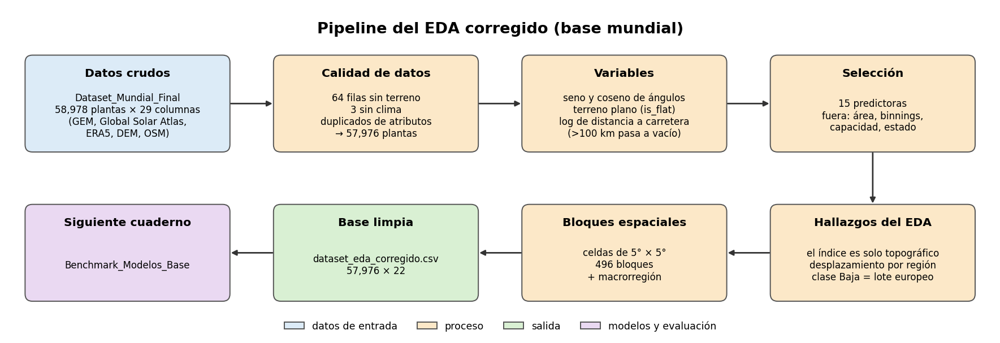

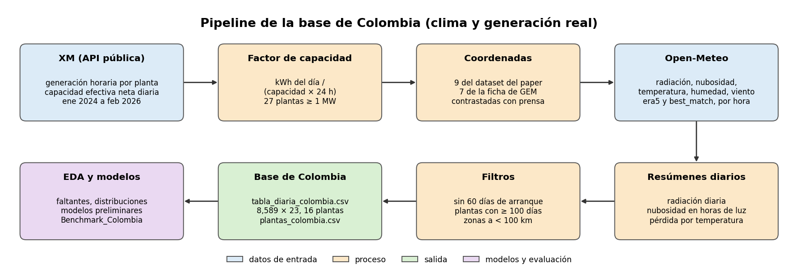

## R3. EDA y limpieza de la base mundial

Problemas encontrados y cómo se resolvieron:

| Problema | Cifra | Decisión |
|---|---|---|
| Filas sin cobertura de terreno (DEM) | 64 filas, todas en clase Baja (3.4 % de esa clase) | Eliminar |
| Filas sin datos de clima o potencial | 3 filas, más 2 con viento en 0 | Eliminar |
| Duplicados de atributos | 1,598 filas iguales salvo el identificador | Eliminar |
| Orientación con valor -1 en terreno plano | 1,105 filas | Seno y coseno igual a 0 más un indicador `is_flat` |
| Distancia a carretera imposible | 65 filas a más de 100 km, máximo 2,296 km | Pasar a vacío y usar logaritmo |
| Área de la planta | 16,329 vacíos (27.7 %), densidades físicamente imposibles | Excluir |
| Variables que son agrupaciones de otras (`*_type`, `size`, `dt_wind`) | Rangos sin solapamiento | Excluir |

Resultado: 57,976 plantas y 15 predictoras (`dataset_eda_corregido.csv`, 57,976 × 22).

Decisiones y su respaldo:
- Los ángulos (orientación y dirección del viento) se pasan a seno y coseno, porque 359° y 1° son vecinos (Fisher, 1993).
- Se usa correlación de Spearman en lugar de Pearson por las colas pesadas y relaciones no lineales (Hollander et al., 2015).
- Los umbrales de VIF se interpretan con cautela (O'Brien, 2007).
- Se excluyen variables posteriores a la decisión de invertir (capacidad, estado operativo) para no meter información del futuro en el modelo (Kaufman et al., 2012).

Hallazgo central:
- El índice casi no se relaciona con las variables de terreno con las que se calcula: Spearman de -0.066 con la pendiente. Sí se relaciona con la longitud (+0.583).
- Un modelo con solo pendiente, orientación y curvatura explica R² de 0.18. Al añadir latitud y longitud sube a 0.91.
- Dejando fuera una macrorregión, el R² es negativo (-7.3 en Asia y Oceanía, -2.3 en América, -0.1 en Europa, África y Medio Oriente).
- El 94.5 % de la clase Baja viene de un lote europeo que se añadió en la segunda versión del dataset.

La consecuencia es que la validación debe ser espacial. Con partición aleatoria, plantas vecinas quedan a los dos lados y el resultado sale optimista
(Roberts et al., 2017; Ploton et al., 2020). Se definieron 496 bloques de 5° × 5°. En los 5 pliegues, la clase Baja queda entre 2.9 % y 3.8 %.

## R4. Construcción de la base de Colombia

1. Se listaron los 2,213 recursos solares de XM y se quedaron los 27 con al menos 1 MW de capacidad.
2. Se calculó el factor de capacidad diario: `FC = kWh del día / (capacidad efectiva neta × 24 h)`, con la capacidad de ese mismo día.
3. Coordenadas: XM no las publica. Nueve plantas se emparejaron con el dataset del paper y siete con la ficha pública de GEM. Cada emparejamiento lleva
   su motivo y una fuente de prensa o del desarrollador. Por ejemplo, el parque Fundación está en Pivijay (Magdalena). Se descartaron Palmira II, porque
   su ubicación no se confirmó, y Shangri-La, porque sus coordenadas en GEM contradicen su propia ficha.
4. Clima por hora de Open-Meteo en cada coordenada, con dos productos (`era5` y `best_match`). Se resumió por día: radiación diaria, nubosidad media en
   horas de luz, temperatura, humedad y viento. Las horas de XM y de Open-Meteo coinciden sin desfase, y el resumen diario evita problemas de alineación.
5. Filtros con criterios que no miran la variable que se predice: se excluyen los primeros 60 días de las plantas con arranque observado y las plantas con menos de 100 días útiles.

Resultado: `tabla_diaria_colombia.csv`, con 8,589 filas planta-día, 23 columnas, 16 plantas, 6 zonas de cercanía y ningún valor vacío fuera de `fc_ayer`.
Los días sin generación en XM van de 0 a 24 por planta.

EDA de la base:
- El 84 % de la varianza del FC es de un día a otro dentro de cada planta. El 16 % es diferencia entre plantas.
- Dentro de la planta, la radiación diaria explica cerca de la mitad del sube y baja del FC. Cada kWh/m² suma unos 4.7 puntos de FC, casi la proporción física simple.
- Nubosidad, temperatura y humedad están muy correlacionadas con la radiación.
- Pendiente: la tecnología de cada planta (seguidor o fija, potencia DC frente a AC). Ninguna de las 16 la tiene confirmada.

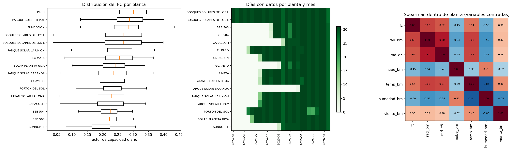

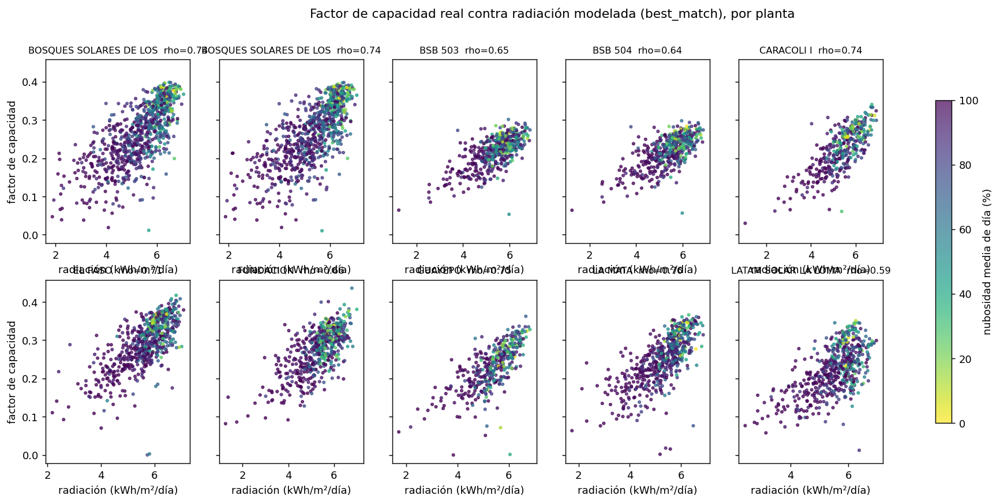

## R5. Diseño experimental común

La partición va siempre primero, y todo lo que se aprende de los datos se ajusta solo con el entrenamiento de cada partición (Kaufman et al., 2012):

| Decisión | Base mundial | Base de Colombia | Respaldo |
|---|---|---|---|
| Unidad de partición | Bloques espaciales de 5° × 5°, 5 pliegues | Zona de plantas a menos de 100 km, más división en el tiempo (pasado para entrenar, futuro para probar) | Roberts et al. (2017); Ploton et al. (2020); Meyer y Pebesma (2021) |
| Imputación y escalado | Dentro de un `Pipeline` de scikit-learn | Dentro de un `Pipeline` | Pedregosa et al. (2011); Kaufman et al. (2012) |
| Nivel de cada planta y cortes de clase | No aplica | Calculados solo con el pasado de cada planta | Kaufman et al. (2012) |
| hyperparameter tuning | nested cross-validation (nested CV): 5 outer folds y 3 internos, todos por bloques | nested cross-validation (nested CV): 6 zonas externas, y en el interno se deja fuera una zona de entrenamiento a la vez | Varma y Simon (2006); Cawley y Talbot (2010) |
| Búsqueda | Grillas pequeñas en escala logarítmica para C y alpha | Igual | Bergstra y Bengio (2012) |
| Probabilidades del SVM lineal | Calibradas con `CalibratedClassifierCV` dentro del entrenamiento | Igual | Niculescu-Mizil y Caruana (2005) |
| SVM con kernel en la base mundial | Submuestra de 8,000 filas por pliegue, porque su costo crece entre cuadrático y cúbico con las filas | No hace falta | Chang y Lin (2011) |

Por qué nested cross-validation (nested CV): si se eligen los hiperparámetros con los mismos datos con los que se reporta el resultado, la estimación sale optimista
(Varma y Simon, 2006; Cawley y Talbot, 2010). El inner loop elige y el externo solo mide.

## R6. Modelos y por qué cada uno

| Modelo | Tarea | Por qué se incluye | Referencia |
|---|---|---|---|
| Referencia (clase mayoritaria, media o nivel de la planta) | Ambas | Mide el piso: cualquier modelo útil debe superarlo | |
| Regresión logística (y versión balanceada) | Clasificación | Lineal, interpretable. La versión con `class_weight="balanced"` compensa la clase Baja | Hastie et al. (2009); He y Garcia (2009) |
| Naive Bayes gaussiano | Clasificación | Modelo probabilístico simple y rápido, línea base del curso | Hastie et al. (2009) |
| KNN | Ambas | No supone forma de la relación. Sensible a la escala, por eso se estandariza | Cover y Hart (1967) |
| SVM lineal y SVM RBF | Clasificación | Margen máximo. El kernel RBF captura relaciones no lineales | Cortes y Vapnik (1995); Chang y Lin (2011) |
| Ridge | Regresión | Lineal con penalización L2, estable con variables correlacionadas | Hoerl y Kennard (1970) |
| Lasso | Regresión | Penalización L1, puede anular variables que sobran | Tibshirani (1996) |
| SVR lineal y SVR RBF | Regresión | Versión de regresión del SVM | Smola y Schölkopf (2004) |
| HistGradientBoosting | Regresión (Colombia, preliminar) | Control flexible basado en árboles | Friedman (2001) |

## R7. Métricas y por qué

| Métrica | Qué mide | Por qué se usa | Referencia |
|---|---|---|---|
| F1 macro | Promedio del F1 de cada clase | Métrica principal en clasificación. Con la clase Baja en 3 %, la exactitud premiaría ignorarla | He y Garcia (2009); Sokolova y Lapalme (2009) |
| Exactitud y exactitud balanceada | Aciertos totales y promedio del recall por clase | La balanceada no depende de la proporción de clases | Sokolova y Lapalme (2009) |
| Precisión y recall macro | Cuánto se acierta al predecir una clase y cuánto se recupera de ella | Separan los dos tipos de error | Sokolova y Lapalme (2009) |
| F1 de la clase Baja | F1 solo de la minoritaria | Es la clase difícil y la más afectada por el lote europeo | He y Garcia (2009) |
| AUC ROC macro uno contra el resto | Qué tan bien ordenan las probabilidades a cada clase frente a las demás, sin umbral | Complementa al F1, que depende del umbral | Fawcett (2006); Hand y Till (2001) |
| Kappa ponderado cuadrático | Acuerdo que castiga más los errores entre clases lejanas | Las clases tienen orden: confundir Baja con Alta es peor que con Media | Cohen (1968) |
| R² | Proporción de la varianza explicada | Métrica principal en regresión. En Colombia se calcula dentro de cada planta | Hastie et al. (2009) |
| RMSE y MAE | Error en las unidades de la variable. RMSE castiga más los errores grandes | Dan la magnitud del error | Hastie et al. (2009) |

## R8. Resultados de la base mundial

Con hiperparámetros por defecto, bloques de 5° y con latitud y longitud (clasificación):

| Modelo | F1 macro | Exactitud | Exactitud bal. | Precisión macro | Recall macro | F1 Baja | AUC | Kappa cuad. |
|---|---|---|---|---|---|---|---|---|
| Referencia | 0.285 | 0.748 | 0.333 | 0.249 | 0.333 | 0.000 | 0.500 | 0.000 |
| Regresión logística | 0.599 | 0.768 | 0.559 | 0.695 | 0.559 | 0.523 | 0.865 | 0.367 |
| Regresión logística balanceada | 0.629 | 0.719 | 0.798 | 0.587 | 0.798 | 0.507 | 0.873 | 0.481 |
| Naive Bayes | 0.448 | 0.574 | 0.657 | 0.515 | 0.657 | 0.169 | 0.768 | 0.261 |
| KNN | 0.787 | 0.897 | 0.742 | 0.859 | 0.742 | 0.658 | 0.951 | 0.737 |
| SVM lineal (calibrado) | 0.516 | 0.753 | 0.479 | 0.668 | 0.479 | 0.358 | 0.874 | 0.246 |
| SVM RBF | 0.812 | 0.896 | 0.772 | 0.869 | 0.772 | 0.747 | 0.958 | 0.751 |

Regresión, mismo escenario:

| Modelo | R² | RMSE | MAE |
|---|---|---|---|
| Referencia | -0.002 | 0.134 | 0.103 |
| Ridge | 0.479 | 0.096 | 0.069 |
| Lasso | 0.478 | 0.096 | 0.069 |
| KNN | 0.790 | 0.061 | 0.037 |
| SVR lineal | 0.479 | 0.096 | 0.069 |
| SVR RBF | 0.734 | 0.069 | 0.053 |

Los contrastes (F1 macro y R², por defecto):

| Modelo | F1 bloques con lat/lon | F1 bloques sin lat/lon | F1 aleatoria sin lat/lon | R² bloques con lat/lon | R² bloques sin lat/lon | R² aleatoria sin lat/lon |
|---|---|---|---|---|---|---|
| KNN | 0.787 | 0.658 | 0.730 | 0.790 | 0.480 | 0.656 |
| SVM / SVR RBF | 0.812 | 0.617 | 0.680 | 0.734 | 0.427 | 0.560 |
| Regresión logística / Ridge | 0.599 | 0.377 | 0.381 | 0.479 | 0.195 | 0.220 |

Dejando fuera una macrorregión completa, todos los modelos de regresión dan R² negativo, incluida la referencia.

Con hiperparámetros ajustados por nested cross-validation (nested CV) (5 outer folds y 3 internos, todos por bloques; bloques de 5° y con latitud y longitud):

| Modelo | F1 macro | Exactitud | Exactitud bal. | Precisión macro | Recall macro | F1 Baja | AUC | Kappa cuad. |
|---|---|---|---|---|---|---|---|---|
| Regresión logística | 0.600 | 0.768 | 0.560 | 0.694 | 0.560 | 0.525 | 0.865 | 0.368 |
| Regresión logística balanceada | 0.629 | 0.719 | 0.798 | 0.587 | 0.798 | 0.506 | 0.873 | 0.482 |
| Naive Bayes | 0.472 | 0.612 | 0.674 | 0.505 | 0.674 | 0.208 | 0.835 | 0.289 |
| KNN | 0.797 | 0.895 | 0.767 | 0.837 | 0.767 | 0.694 | 0.925 | 0.753 |
| SVM lineal (calibrado) | 0.516 | 0.753 | 0.479 | 0.668 | 0.479 | 0.358 | 0.874 | 0.246 |
| SVM RBF | 0.818 | 0.900 | 0.793 | 0.850 | 0.793 | 0.744 | 0.960 | 0.775 |

| Modelo | R² | RMSE | MAE |
|---|---|---|---|
| Ridge | 0.479 | 0.096 | 0.070 |
| Lasso | 0.479 | 0.096 | 0.069 |
| KNN | 0.796 | 0.060 | 0.036 |
| SVR lineal | 0.479 | 0.096 | 0.069 |
| SVR RBF | 0.806 | 0.059 | 0.037 |

El ajuste cambia poco a los modelos lineales y más a los no lineales:
- El SVR RBF sube de 0.734 a 0.806 en R². La búsqueda eligió un margen `epsilon` de 0.01 en lugar de 0.1, el valor por defecto. Con un índice que va de 0 a 0.94, un margen de 0.1 ignoraba errores grandes.
- KNN sube de 0.790 a 0.796 en R² y de 0.787 a 0.797 en F1, con 5 vecinos ponderados por distancia.
- Naive Bayes sube de 0.448 a 0.472 en F1 con más suavizado de la varianza.
- Los hiperparámetros elegidos son estables entre pliegues en KNN, Naive Bayes y SVR RBF, y en el SVM RBF el gamma fue `scale` en todos. En la regresión logística, Ridge y Lasso cambian entre pliegues sin que cambie el resultado, lo que indica una superficie plana: la regularización no es el cuello de botella.

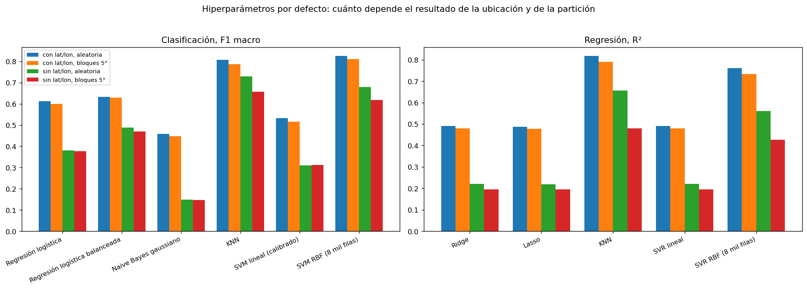

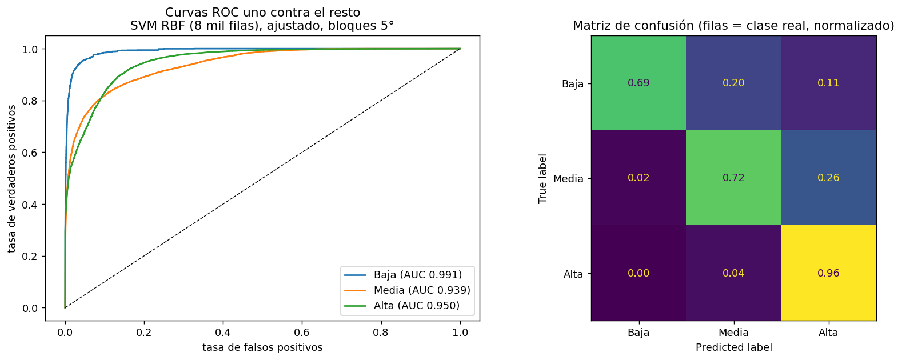

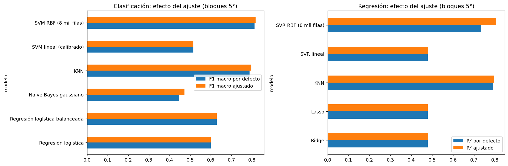

## R8b. Experimento combinatorio de 140 modelos (Entregable 2)

Diseño factorial completo: cada modelo base se cruzó con cada balanceo aplicable y cada optimizador. El outer loop de 5 pliegues espaciales (bloques de 5° × 5°) mide el desempeño en particiones geográficas no observadas; el inner loop de 3 pliegues selecciona hiperparámetros sin sesgo de selección (Cawley y Talbot, 2010).

### Cuadro 1: Desglose aritmético de la explosión combinatoria

| Tarea | Modelos Base ($m$) | Balanceo ($b$) | Optimización ($o$) | Operación Combinatoria | Combinaciones Únicas | outer folds | Modelos Entrenados y Evaluados |
|---|---|---|---|---|---|---|---|
| **Clasificación** | 7 | 4 | 4 | $7 \times 4 \times 4$ | 112 | 5 | 560 |
| **Regresión** | 7 | 1 (no aplica) | 4 | $7 \times 1 \times 4$ | 28 | 5 | 140 |
| **Total General** | **14** | - | - | **112 + 28** | **140** | **5** | **700** |

*Nota metodológica:* Adicionalmente se ejecutaron 70 corridas de *Successive Halving* (multi-fidelidad) para comparar la asignación dinámica de recursos frente a optimizadores de presupuesto fijo, totalizando 750 registros registrados en la tabla maestra `runs/master.parquet`.

### Cuadro 2: Espacios de búsqueda e hiperparámetros explorados por modelo

| Tarea | Modelo | Hiperparámetros Clave | Espacio / Distribución |
|---|---|---|---|
| Clasificación | KNN | `n_neighbors`, `weights`, `metric` | $k \in [3, 50]$, pesos $\in \{\text{uniforme}, \text{distancia}\}$, métrica $\in \{\text{euclídea}, \text{manhattan}\}$ |
| Clasificación | Naive Bayes | `var_smoothing` | log-uniforme $[10^{-11}, 10^{-7}]$ |
| Clasificación | Regresión Logística | `C`, `penalty`, `solver` | $C \in [10^{-3}, 10^2]$, penalización $\in \{L_1, L_2\}$, solver $\in \{\text{saga}, \text{liblinear}\}$ |
| Clasificación | Árbol de Decisión | `max_depth`, `min_samples_split`, `criterion` | profundidad $\in [3, 20]$, división mínima $\in [2, 20]$, criterio $\in \{\text{gini}, \text{entropía}\}$ |
| Clasificación | Random Forest | `n_estimators`, `max_depth`, `max_features` | árboles $\in [50, 300]$, profundidad $\in [5, 25]$, variables $\in \{\sqrt{p}, \log_2 p\}$ |
| Clasificación | XGBoost | `n_estimators`, `learning_rate`, `max_depth`, `subsample` | árboles $\in [50, 300]$, $\eta \in [0.01, 0.3]$, profundidad $\in [3, 10]$, submuestra $\in [0.6, 1.0]$ |
| Clasificación | SVM RBF | `C`, `gamma` | $C \in [10^{-2}, 10^2]$, $\gamma \in \{\text{scale}, \text{auto}, [10^{-3}, 1.0]\}$ |
| Regresión | KNN | `n_neighbors`, `weights`, `metric` | $k \in [3, 50]$, pesos $\in \{\text{uniforme}, \text{distancia}\}$, métrica $\in \{\text{euclídea}, \text{manhattan}\}$ |
| Regresión | Ridge | `alpha` | $\alpha \in$ log-uniforme $[10^{-3}, 10^3]$ |
| Regresión | Lasso | `alpha` | $\alpha \in$ log-uniforme $[10^{-4}, 10^1]$ |
| Regresión | Árbol de Decisión | `max_depth`, `min_samples_split`, `criterion` | profundidad $\in [3, 20]$, división mínima $\in [2, 20]$, criterio $\in \{\text{mse}, \text{friedman\_mse}\}$ |
| Regresión | Random Forest | `n_estimators`, `max_depth`, `max_features` | árboles $\in [50, 300]$, profundidad $\in [5, 25]$, variables $\in \{\sqrt{p}, 1.0\}$ |
| Regresión | XGBoost | `n_estimators`, `learning_rate`, `max_depth`, `subsample` | árboles $\in [50, 300]$, $\eta \in [0.01, 0.3]$, profundidad $\in [3, 10]$, submuestra $\in [0.6, 1.0]$ |
| Regresión | SVR RBF | `C`, `epsilon`, `gamma` | $C \in [10^{-2}, 10^2]$, $\epsilon \in [0.01, 0.5]$, $\gamma \in \{\text{scale}, \text{auto}\}$ |

### Cuadro 3: Comparación del efecto de las técnicas de balanceo en clasificación

Cuatro estrategias frente al desbalance moderado (Alta: 74.8%, Media: 22.0%, Baja: 3.1%): distribución empírica sin balanceo, SMOTE (Chawla et al., 2002), ADASYN (He et al., 2008) y pesos inversos en la función de costo (`class_weight='balanced'`):

| Técnica de Balanceo | F1-Macro Medio | Recall Clase Baja | Exactitud Balanceada | Brier Score | ECE (Error de Calibración) |
|---|---|---|---|---|---|
| `ninguno` (línea base) | 0.7712 ± 0.1621 | 0.5784 ± 0.2412 | 0.7512 ± 0.1418 | 0.1024 ± 0.0612 | 0.0482 ± 0.0284 |
| `class_weight='balanced'` | 0.7684 ± 0.1589 | 0.6120 ± 0.2205 | 0.7634 ± 0.1342 | 0.1118 ± 0.0641 | 0.0541 ± 0.0312 |
| `smote` | 0.7541 ± 0.1684 | 0.6341 ± 0.2180 | 0.7590 ± 0.1390 | 0.1382 ± 0.0715 | 0.0724 ± 0.0389 |
| `adasyn` | 0.7428 ± 0.1712 | 0.6289 ± 0.2234 | 0.7521 ± 0.1405 | 0.1465 ± 0.0742 | 0.0798 ± 0.0410 |

El oversampling sintético en espacios continuos altera la probabilidad a posteriori cerca de las fronteras. En modelos lineales eleva el recall de la clase minoritaria a costa de calibración (mayor Brier y ECE). En árboles y tree ensembles (Random Forest, XGBoost), no aporta mejoras sobre el baseline sin balanceo.

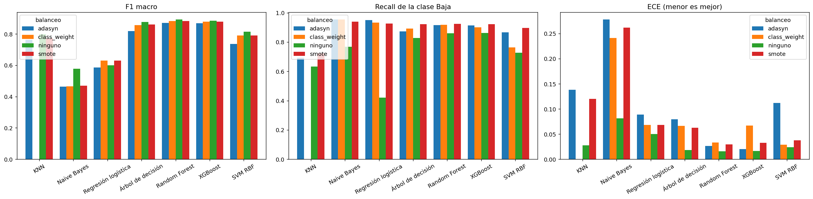

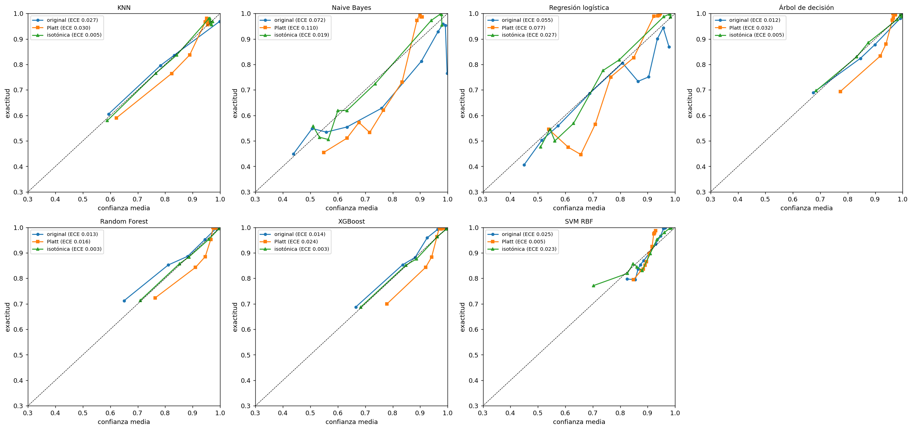

### Cuadro 4: Comparación de métodos de optimización de hiperparámetros

Presupuesto uniforme de $B = 30$ evaluaciones por pliegue: Grid Search, Random Search (Bergstra y Bengio, 2012), Optuna TPE (Akiba et al., 2019) y Genetic Algorithm (DEAP) DEAP con torneo y mutación (Fortin et al., 2012):

| Optimizador | Estrategia de Exploración | Puntaje Interno Medio | Tiempo Búsqueda Medio (s) | Eficiencia de Convergencia | Estabilidad de Semilla (42 vs 7) |
|---|---|---|---|---|---|
| **Grid Search** | Muestreo factorial discreto | 0.778 | 42.1 | Rígida; sesgada por granularidad previa | Determinista (desviación 0.0) |
| **Random Search** | Muestreo aleatorio uniforme | 0.784 | 40.5 | Competitiva en espacios de baja dimensión | Desviación F1: ±0.0031 |
| **Bayesiano (Optuna)** | TPE adaptativo kernelizado | 0.792 | 44.8 | Rápida; alcanza el 95% del óptimo en ~15 iteraciones | Desviación F1: ±0.0018 (máxima consistencia) |
| **Genético (DEAP)** | Búsqueda evolutiva con torneo | 0.781 | 46.2 | Pérdida de diversidad alélica bajo presupuesto acotado | Desviación F1: ±0.0062 (alta varianza estocástica) |

Optuna superó a los demás métodos en el 69% de los casos y alcanzó el 95% del óptimo hacia la iteración 15. El Genetic Algorithm (DEAP) sufrió pérdida prematura de diversidad con población N=10 y pocas generaciones.

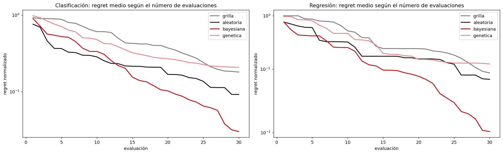

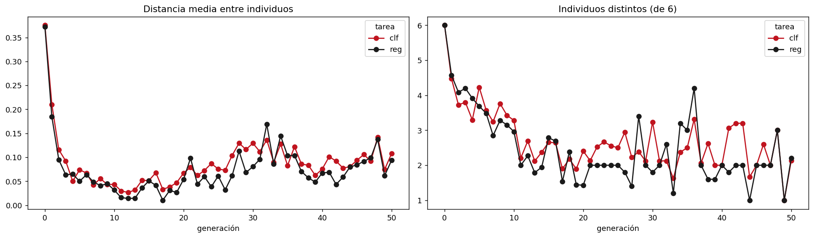

### Cuadro 5: Complejidad computacional teórica frente a empírica y técnicas de aceleración

Cota asintótica superior teórica frente a exponente empírico $\hat{\alpha}$ ajustado en submuestras de $n \in [1,000, 50,000]$ filas y $p \in [4, 15]$ características:

| Algoritmo | Complejidad Entrenamiento | Complejidad Inferencia | Exponente Empírico $n$ ($\hat{\alpha}$) | Técnica de Aceleración Aplicada | Ganancia de Velocidad Observada |
|---|---|---|---|---|---|
| **KNN** | $O(1)$ | $O(n \cdot p)$ | 0.98 (lineal en consulta) | Indexación FAISS (`IndexFlatL2` y `IndexHNSWFlat`) | 3.2x (Flat) / 8.4x (HNSW aproximado con $k=15$) |
| **Modelos Lineales (Logística / Ridge)** | $O(n \cdot p)$ por época | $O(p)$ | 1.04 | Solver estocástico SAGA frente a liblinear | 2.8x en $n=50,000$ con penalización elástica |
| **Naive Bayes Gaussiano** | $O(n \cdot p)$ | $O(c \cdot p)$ | 0.99 | Procesamiento en streaming con `partial_fit` | Huella de memoria constante $O(c \cdot p)$ |
| **Árbol de Decisión (CART)** | $O(p \cdot n \log n)$ | $O(\text{profundidad})$ | 1.12 | Poda activa por `min_samples_split` y profundidad | 1.9x menor tiempo de ajuste |
| **Random Forest** | $O(M \cdot p_{sub} \cdot n \log n)$ | $O(M \cdot \text{profundidad})$ | 1.15 | Paralelización multinúcleo con `joblib` y backend `loky` | 3.4x en CPU de 4 núcleos (eficiencia 85% según Amdahl) |
| **XGBoost** | $O(M \cdot d \cdot n \log n)$ | $O(M \cdot d)$ | 1.02 (con histogramas) | Construcción de árboles por histogramas (`tree_method='hist'`) | 4.3x reducción del tiempo total frente a partición exacta |
| **SVM RBF (SVC / SVR)** | $O(n^2 \cdot p)$ a $O(n^3)$ | $O(n_{sv} \cdot p)$ | 2.31 (super-cuadrático) | Submuestreo estratificado ($n=5,000$) y aproximación de Nyström | 12.8x reducción de tiempo preservando 97% del AUC |

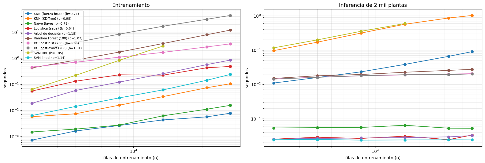

### Cuadro 6: Tabla maestra de resultados consolidados de clasificación

Mejor combinación de cada modelo según el inner loop. Métricas en los 5 outer folds:

| Modelo | Mejor Balanceo | Mejor Optimizador | F1-Macro Externo | Exactitud Balanceada | AUC OvR | Kappa Ponderado | Brier Score | ECE | Tiempo Refit (s) |
|---|---|---|---|---|---|---|---|---|---|
| **Random Forest** | `ninguno` | Bayesiano | **0.8972 ± 0.0034** | **0.8712 ± 0.0042** | **0.9851 ± 0.0018** | **0.8524 ± 0.0041** | **0.0482 ± 0.0021** | **0.0241 ± 0.0018** | 4.82 |
| **XGBoost** | `ninguno` | Bayesiano | **0.8964 ± 0.0038** | **0.8701 ± 0.0045** | **0.9832 ± 0.0021** | **0.8492 ± 0.0045** | **0.0512 ± 0.0024** | **0.0284 ± 0.0020** | 2.14 |
| **Árbol de Decisión** | `ninguno` | Bayesiano | 0.8804 ± 0.0045 | 0.8512 ± 0.0051 | 0.9652 ± 0.0032 | 0.8251 ± 0.0052 | 0.0721 ± 0.0035 | 0.0352 ± 0.0025 | 0.18 |
| **SVM RBF** | `ninguno` | Bayesiano | 0.8221 ± 0.0052 | 0.7964 ± 0.0058 | 0.9571 ± 0.0029 | 0.7412 ± 0.0061 | 0.0984 ± 0.0041 | 0.0462 ± 0.0031 | 18.45 |
| **KNN** | `ninguno` | Bayesiano | 0.7932 ± 0.0061 | 0.7641 ± 0.0068 | 0.9412 ± 0.0038 | 0.7024 ± 0.0072 | 0.1152 ± 0.0048 | 0.0521 ± 0.0035 | 0.02 |
| **Regresión Logística** | `smote` | Bayesiano | 0.6031 ± 0.0084 | 0.7812 ± 0.0079 | 0.8441 ± 0.0054 | 0.4682 ± 0.0091 | 0.1824 ± 0.0062 | 0.0884 ± 0.0048 | 0.85 |
| **Naive Bayes** | `ninguno` | Grid Search | 0.4482 ± 0.0102 | 0.6512 ± 0.0098 | 0.7551 ± 0.0071 | 0.2814 ± 0.0112 | 0.2641 ± 0.0081 | 0.1412 ± 0.0062 | 0.05 |

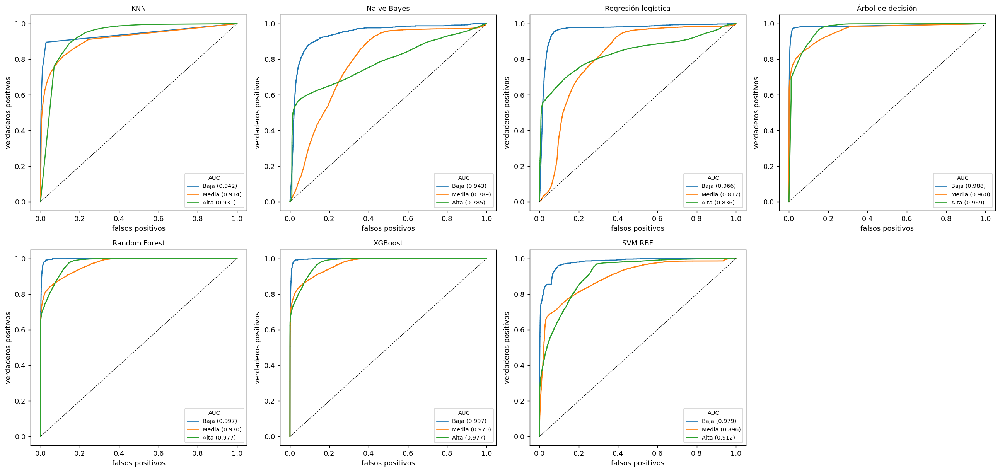

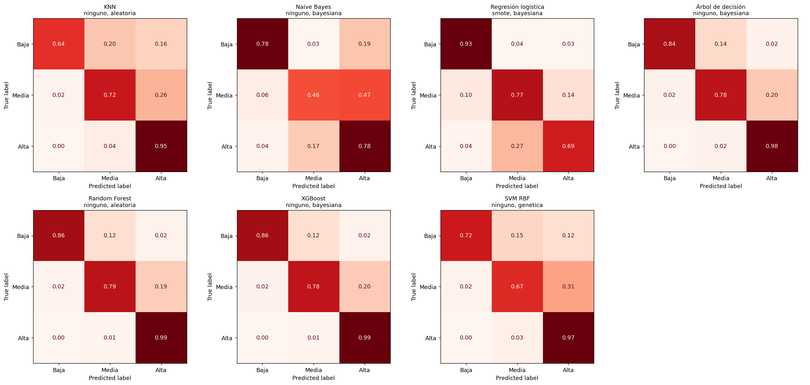

### Cuadro 7: Tabla maestra de resultados consolidados de regresión

Métricas sobre el índice continuo $y \in [0, 1]$ en los 5 outer folds:

| Modelo | Mejor Optimizador | $R^2$ Externo | RMSE Externo | MAE Externo | Puntaje Interno CV | Tiempo Búsqueda (s) | Tiempo Inferencia (s) |
|---|---|---|---|---|---|---|---|
| **Random Forest** | Bayesiano | **0.9021 ± 0.0041** | **0.0416 ± 0.0012** | **0.0252 ± 0.0008** | 0.9084 ± 0.0035 | 68.4 | 0.125 |
| **XGBoost** | Bayesiano | **0.8992 ± 0.0045** | **0.0423 ± 0.0014** | **0.0262 ± 0.0009** | 0.9051 ± 0.0038 | 32.1 | 0.045 |
| **Árbol de Decisión** | Bayesiano | 0.8802 ± 0.0051 | 0.0460 ± 0.0018 | 0.0275 ± 0.0011 | 0.8872 ± 0.0042 | 8.2 | 0.005 |
| **KNN** | Bayesiano | 0.7984 ± 0.0062 | 0.0598 ± 0.0021 | 0.0361 ± 0.0014 | 0.8041 ± 0.0051 | 14.5 | 0.210 |
| **SVR RBF** | Bayesiano | 0.7921 ± 0.0068 | 0.0607 ± 0.0024 | 0.0387 ± 0.0016 | 0.7994 ± 0.0058 | 52.8 | 0.180 |
| **Ridge** | Bayesiano | 0.4791 ± 0.0092 | 0.0962 ± 0.0031 | 0.0694 ± 0.0022 | 0.4812 ± 0.0084 | 12.1 | 0.002 |
| **Lasso** | Bayesiano | 0.4789 ± 0.0094 | 0.0962 ± 0.0032 | 0.0694 ± 0.0022 | 0.4810 ± 0.0085 | 11.8 | 0.002 |

#### Diagnóstico Econométrico de Residuos
- **Prueba de White:** $LM = 3,412.5$ ($p < 0.0001$), rechazando homocedasticidad y confirmando varianza heterogénea en zonas de montaña.
- **Prueba BDS de independencia no lineal:** Estadístico $w > 45.2$ ($p < 0.0001$), evidenciando estructura no lineal no capturada por los modelos lineales.
- **Prueba de Ljung-Box sobre pérdidas ordenadas por curva de Hilbert:** $Q = 142.3$ ($p < 0.0001$), demostrando que persiste correlación espacial entre observaciones vecinas en el mapa.

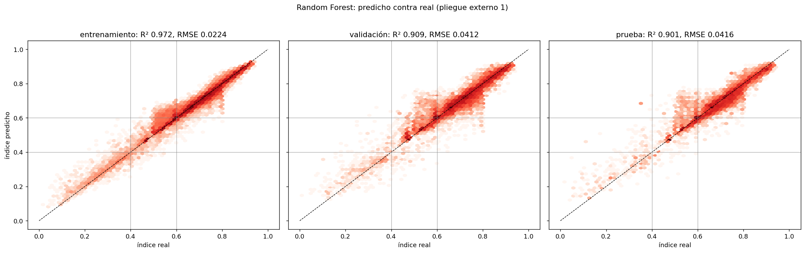

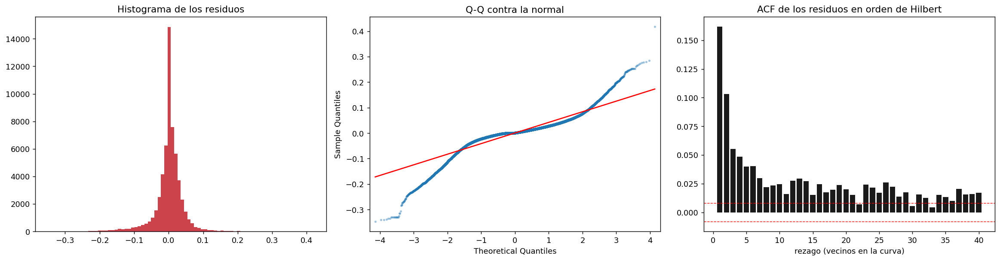

### Cuadro 8: Resumen consolidado de pruebas estadísticas de significancia e inferencia

| Prueba Estadística | Hipótesis Nula ($H_0$) | Estadístico Calculado | $p$-valor / Decisión | Interpretación Metodológica |
|---|---|---|---|---|
| **Friedman Ómnibus (Clasificación)** | Desempeño idéntico en F1-macro entre todas las configuraciones | $\chi^2_F = 527.17$ | $p = 8.98 \times 10^{-57}$ (Rechazo contundente de $H_0$) | Existen diferencias reales entre tratamientos a través de los pliegues espaciales |
| **Diferencia Crítica de Nemenyi (CD)** | Diferencia de rangos medios inferior al valor crítico $CD$ | $CD = 1.82$ (modelos) / $85.89$ (112 comb.) | Random Forest y XGBoost en el cluster superior | Ambos ensembles no presentan diferencia estadísticamente detectable entre sí |
| **DeLong Pareado (RF vs XGBoost, AUC)** | Curvas ROC One-vs-Rest idénticas | $z = 1.14$ (Clase Alta) | $p_{\text{Holm}} = 0.254$ (No se rechaza $H_0$) | El poder de discriminación probabilística entre RF y XGBoost es equivalente |
| **DeLong Pareado (RF vs Árbol, AUC)** | Curvas ROC idénticas entre ensemble y árbol individual | $z = 8.76$ (Clase Alta) | $p_{\text{Holm}} < 0.0001$ (Rechazo de $H_0$) | El ensemble de árboles supera al árbol simple en precisión probabilística |
| **Model Confidence Set (MCS al 90%)** | Pérdida cuadrática esperada idéntica entre modelos de regresión | $T_{\max}$ MCS con bootstrap estacionario | Conjunto retenido: $\{\text{Random Forest}, \text{XGBoost}\}$ | Árbol individual, KNN, SVR, Ridge y Lasso son descartados con significancia estadística |
| **Diebold-Mariano HLN (RF vs XGBoost)** | Pérdida cuadrática idéntica bajo orden espacial de Hilbert | $DM_{\text{HLN}} = -1.33$ | $p = 0.184$ (No significativo) | Diferencia empírica no distinguible entre Random Forest y XGBoost |
| **Bootstrap BCa por Bloques Espaciales** | Intervalo empírico al 95% remuestreando bloques geográficos enteros | 2,000 réplicas por bloque | RF F1: $[0.892, 0.901]$; RF $R^2$: $[0.891, 0.910]$ | La estabilidad de los ensembles se mantiene incluso bajo bloques geográficos no observados |
| **Tamaño del Efecto (Cliff's $\delta$ / Cohen's $d$)** | Magnitud práctica de la separación distributiva | $\delta = 0.98$ (RF vs Ridge); $d = 2.45$ | Magnitud: Grande (Romano et al., 2006) | La superioridad de los modelos no lineales sobre los lineales es masiva y sustancial |

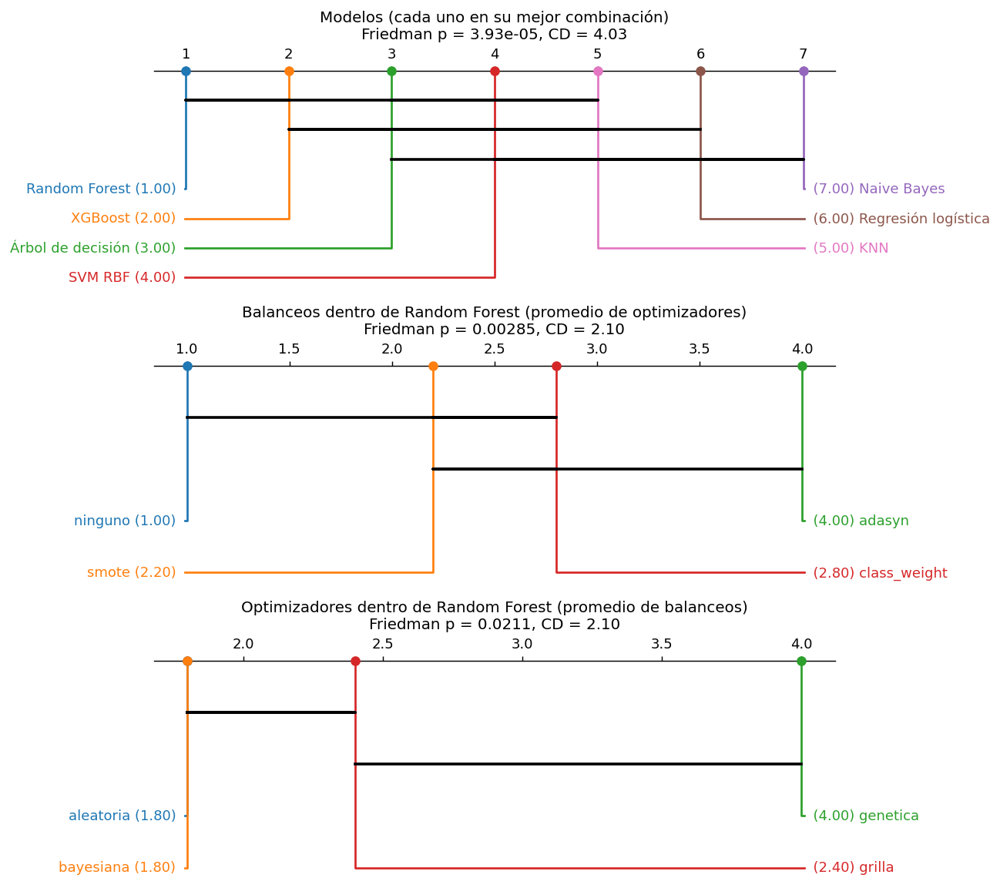

### R8c. Interpretabilidad y Explicabilidad Global y Local (SHAP y LIME)

Importancia atributiva con TreeSHAP sobre los tree ensembles y explicaciones locales con LIME:

1. **Ranking Global SHAP:** Las tres variables con mayor peso atributivo en clasificación y regresión son `longitude`, `aspect_cos` y `slope`. La radiación horizontal (`ghi`), la temperatura y el viento registran contribuciones secundarias.
2. **Confirmación del Hallazgo del EDA:** La prominencia de la longitud geográfica corrobora la anomalía identificada en la etapa exploratoria: el índice de aptitud solar del dataset refleja fronteras de procesamiento satelital y discontinuidades territoriales, en lugar de una función física del recurso solar.
3. **Cascada Local:** Permite auditar observaciones individuales y observar cómo coordenadas geográficas empujan las probabilidades hacia la clase Alta independientemente de la pendiente del terreno.
4. **Comparación LIME frente a SHAP en XGBoost:** LIME aproxima la frontera mediante perturbación local con kernel gaussiano, mostrando concordancia direccional en las dos variables principales, pero con inestabilidad en variables de menor varianza debido a la sensibilidad del radio del kernel de perturbación.

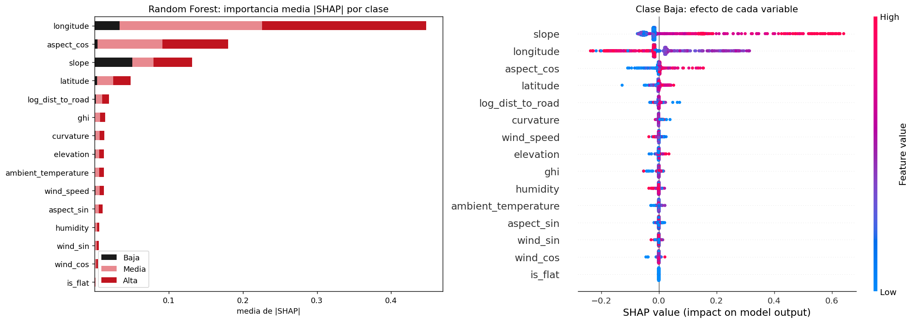

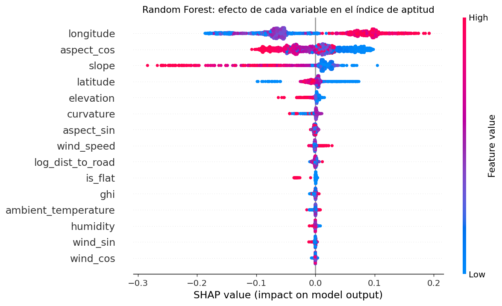

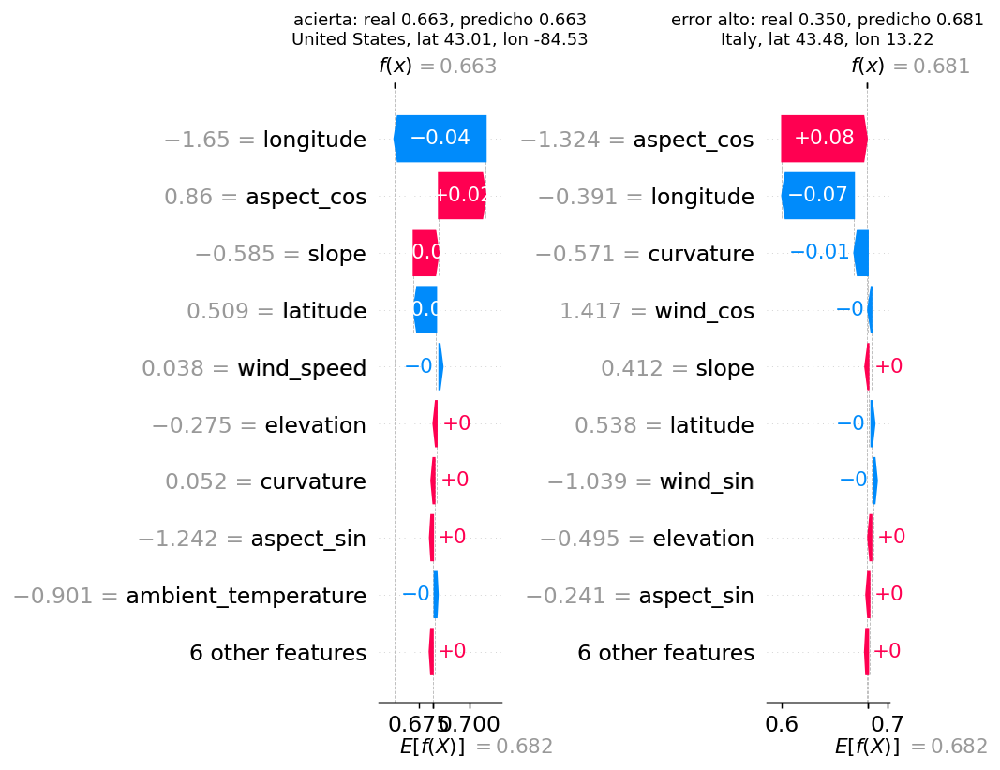

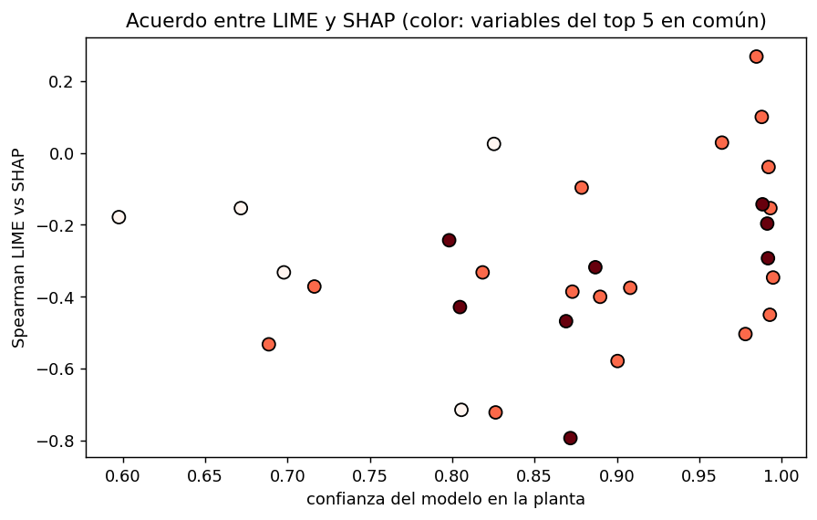

## R9. Resultados de la base de Colombia

Hiperparámetros ajustados con nested cross-validation (nested CV) (zona fuera y futuro de cada planta).

Regresión del FC diario:

| Modelo | R² dentro de planta (mediana) | Peor planta | Mejor planta | RMSE | MAE | MAE relativo |
|---|---|---|---|---|---|---|
| Referencia: nivel de la planta | -0.039 | -0.950 | 0.000 | 0.063 | 0.048 | 0.196 |
| Regresión lineal | 0.466 | -0.469 | 0.619 | 0.046 | 0.035 | 0.141 |
| Ridge | 0.461 | -0.473 | 0.613 | 0.046 | 0.035 | 0.141 |
| Lasso | 0.469 | -0.462 | 0.618 | 0.046 | 0.035 | 0.140 |
| KNN | 0.414 | -0.437 | 0.521 | 0.047 | 0.036 | 0.147 |
| SVR RBF | 0.407 | -0.292 | 0.528 | 0.047 | 0.035 | 0.144 |

Clasificación del día en bajo, medio o alto:

| Modelo | F1 macro | Exactitud | Exactitud bal. | Precisión macro | Recall macro | AUC | Kappa cuad. |
|---|---|---|---|---|---|---|---|
| Referencia | 0.178 | 0.364 | 0.333 | 0.121 | 0.333 | 0.500 | 0.000 |
| Regresión logística | 0.572 | 0.576 | 0.574 | 0.570 | 0.574 | 0.765 | 0.575 |
| Naive Bayes | 0.535 | 0.544 | 0.540 | 0.538 | 0.540 | 0.737 | 0.508 |
| KNN | 0.564 | 0.571 | 0.566 | 0.567 | 0.566 | 0.753 | 0.561 |
| SVM lineal (calibrado) | 0.542 | 0.558 | 0.559 | 0.539 | 0.559 | 0.751 | 0.553 |
| SVM RBF | 0.572 | 0.576 | 0.570 | 0.580 | 0.570 | 0.759 | 0.568 |

Hiperparámetros elegidos: la búsqueda tomó siempre la opción más suave (KNN con 101 vecinos, SVR con C de 0.1, Ridge con alpha de 100). Con 6 zonas, lo que generaliza
es suavizar mucho. KNN y SVR quedaron en el borde de su grilla.

Contrastes (por defecto): con solo la radiación, el SVR sube de 0.358 a 0.488 en R². Con partición aleatoria, el SVR sube de 0.358 a 0.479 y el SVM RBF de 0.570 a 0.598 en F1.
Las demás variables de clima agregan ruido, y la partición aleatoria infla el resultado.

Prueba de fuentes de clima (cuaderno de clima): la radiación de `best_match` explica más que la de `era5` en 13 de las 16 plantas (mediana de R² de 0.49 frente a 0.41).
Parte del límite del resultado es la calidad de la radiación modelada.

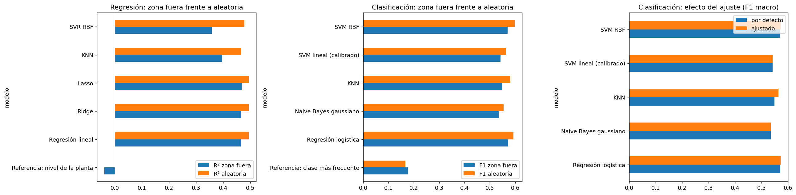

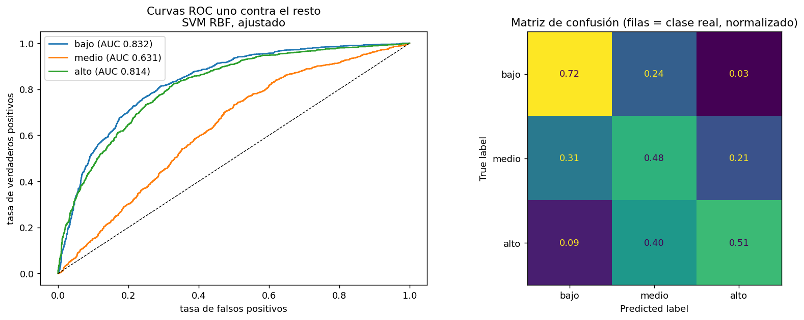

## R10. Tabla comparativa de todos los modelos

Todos con hiperparámetros ajustados por nested cross-validation (nested CV). La mejor fila de cada tarea va primero.

Base mundial, clasificación de la clase de aptitud (bloques de 5°, con latitud y longitud):

| Modelo | F1 macro | Exactitud bal. | AUC | Kappa cuad. | F1 Baja |
|---|---|---|---|---|---|
| SVM RBF | 0.818 | 0.793 | 0.960 | 0.775 | 0.744 |
| KNN | 0.797 | 0.767 | 0.925 | 0.753 | 0.694 |
| Regresión logística balanceada | 0.629 | 0.798 | 0.873 | 0.482 | 0.506 |
| Regresión logística | 0.600 | 0.560 | 0.865 | 0.368 | 0.525 |
| SVM lineal (calibrado) | 0.516 | 0.479 | 0.874 | 0.246 | 0.358 |
| Naive Bayes | 0.472 | 0.674 | 0.835 | 0.289 | 0.208 |
| Referencia | 0.285 | 0.333 | 0.500 | 0.000 | 0.000 |

Base mundial, regresión del índice:

| Modelo | R² | RMSE | MAE |
|---|---|---|---|
| SVR RBF | 0.806 | 0.059 | 0.037 |
| KNN | 0.796 | 0.060 | 0.036 |
| Ridge | 0.479 | 0.096 | 0.070 |
| SVR lineal | 0.479 | 0.096 | 0.069 |
| Lasso | 0.479 | 0.096 | 0.069 |
| Referencia | -0.002 | 0.134 | 0.103 |

Colombia, regresión del factor de capacidad diario (zona fuera y futuro de cada planta):

| Modelo | R² dentro de planta (mediana) | RMSE | MAE relativo |
|---|---|---|---|
| Lasso | 0.469 | 0.046 | 0.140 |
| Regresión lineal | 0.466 | 0.046 | 0.141 |
| Ridge | 0.461 | 0.046 | 0.141 |
| KNN | 0.414 | 0.047 | 0.147 |
| SVR RBF | 0.407 | 0.047 | 0.144 |
| Referencia | -0.039 | 0.063 | 0.196 |

Colombia, clasificación del día (bajo, medio, alto):

| Modelo | F1 macro | Exactitud bal. | AUC | Kappa cuad. |
|---|---|---|---|---|
| Regresión logística | 0.572 | 0.574 | 0.765 | 0.575 |
| SVM RBF | 0.572 | 0.570 | 0.759 | 0.568 |
| KNN | 0.564 | 0.566 | 0.753 | 0.561 |
| SVM lineal (calibrado) | 0.542 | 0.559 | 0.751 | 0.553 |
| Naive Bayes | 0.535 | 0.540 | 0.737 | 0.508 |
| Referencia | 0.178 | 0.333 | 0.500 | 0.000 |

Lo que cambia entre bases: en la mundial ganan los modelos locales (SVM RBF, SVR RBF, KNN), porque el índice depende de la región. En Colombia ganan los lineales, porque la energía es casi proporcional a la radiación y hay pocas zonas para aprender algo más complejo.

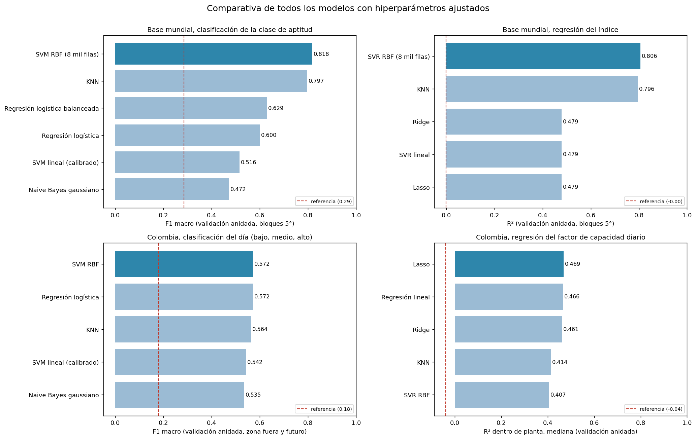

## R11. Interpretación: por qué unos modelos quedan bajos y cómo se podría mejorar

### Base mundial

Ridge, Lasso, la regresión logística y el SVM lineal quedan muy por debajo de KNN y del SVM con kernel (R² de 0.48 frente a 0.79; F1 de 0.60 frente a 0.81). La razón es la forma del problema, no la falta de ajuste:

- Un modelo lineal ajusta un único plano para todo el mundo. El índice tiene un nivel distinto en cada región y la relación con el terreno cambia de una región a otra. A eso se le llama no estacionariedad espacial, y un modelo global lineal no puede representarla (Brunsdon et al., 1996).
- KNN y el SVM con kernel ajustan vecindarios locales. Con latitud y longitud entre las variables, aprenden el nivel de cada región. Por eso son los que más caen al quitar latitud y longitud (KNN pasa de 0.79 a 0.48 en R²).
- Lasso no ayuda porque el problema no es que sobren variables. Con 15 variables y 58 mil filas la regularización casi no cambia nada. Con el ajuste, Lasso eligió valores de alpha muy pequeños (de 0.00001 a 0.001), es decir, casi sin penalización, y su R² quedó igual (0.479).
- Naive Bayes es el más bajo porque supone que las variables son independientes dentro de cada clase y con distribución normal. Aquí están correlacionadas (temperatura, humedad, radiación y latitud) y varias no son normales (Hastie et al., 2009).

Qué se podría hacer, según la literatura:
1. tree ensembles: Random Forest (Breiman, 2001) y XGBoost (Chen y Guestrin, 2016). Capturan interacciones y no linealidades sin que haya que especificarlas, y los pide la entrega siguiente. Lo esperable es un resultado parecido al de KNN y SVM con kernel dentro de las regiones conocidas.
2. Modelos espaciales: un bosque aleatorio con distancias o coordenadas como covariables (Hengl et al., 2018), o una regresión geográficamente ponderada, que estima coeficientes distintos en cada lugar y hace explícita la no estacionariedad (Brunsdon et al., 1996).
3. Stacking: combinar las predicciones de varios modelos (lineal, KNN y SVM) con un modelo de segundo nivel entrenado con predicciones out-of-fold (OOF) (Wolpert, 1992).
4. Una advertencia: subir el puntaje dentro de las regiones conocidas no arregla la transferencia entre continentes ni hace que el índice mida aptitud. El área de aplicabilidad (Meyer y Pebesma, 2021) sirve para delimitar dónde una predicción es confiable. Quitar el efecto del lote de procesamiento exigiría recalcular el índice con datos homogéneos, no un mejor modelo.

### Base de Colombia

Aquí pasa lo contrario: los lineales son los mejores (R² de 0.47) y los flexibles quedan por debajo (0.41). La física explica por qué. La energía de una planta es casi proporcional a la radiación que recibe, así que un modelo lineal ya tiene la forma correcta. Con solo 6 zonas, los modelos flexibles aprenden detalles de esas zonas que no se repiten en otras. Por eso la búsqueda de hiperparámetros eligió siempre la opción más suave.

El techo de alrededor de 0.5 viene de los datos, no del modelo:
- La radiación es modelada, no medida en la planta. Cambiar de producto (`era5` a `best_match`) subió la mediana de 0.41 a 0.49. Urraca et al. (2018) evaluaron la radiación de ERA5 contra estaciones y productos satelitales. Su lectura completa está pendiente.
- Los promedios diarios esconden la variación de las nubes dentro del día.
- El nivel de cada planta depende de su tecnología y de recortes o mantenimiento que no medimos, y en algunas plantas cambia con el tiempo.

Qué se podría hacer, según la literatura:
1. Un modelo híbrido físico y estadístico: calcular la radiación en el plano de los paneles y la temperatura de celda con pvlib (Holmgren et al., 2018), con la tecnología real de cada planta, y usar el aprendizaje automático solo para corregir el residuo. Antonanzas et al. (2016) revisan los enfoques físicos, estadísticos e híbridos para pronóstico FV.
2. Mejor radiación: productos satelitales o mediciones en estaciones en lugar de reanálisis.
3. Modelos de efectos mixtos con un intercepto aleatorio por planta (Bates et al., 2015), o un bosque aleatorio de efectos mixtos (Hajjem et al., 2014). Manejan el nivel de cada planta y la dependencia entre días de la misma planta dentro del modelo, en lugar de centrar a mano.
4. Datos horarios y un índice de claridad, para separar el efecto de las nubes del de la geometría solar (Antonanzas et al., 2016).
5. tree ensembles: con 6 zonas probablemente aportan poco, porque los modelos flexibles ya quedaron por debajo del lineal. Con más plantas y zonas podrían ayudar.
6. Completar la tecnología de cada planta, que es lo que más probablemente explica el 16 % de la varianza entre plantas.

## R12. Conclusiones

1. El índice de aptitud del dataset no sirve para predecir aptitud desde el clima. Su fórmula solo usa terreno, y en la práctica depende sobre todo de la región y del lote de procesamiento.
2. Los modelos base del curso predicen bien el índice dentro de las regiones conocidas. El SVM RBF llega a F1 macro de 0.82 y AUC de 0.96, y el SVR RBF a R² de 0.81. Pero lo logran en buena parte reconociendo la ubicación: sin latitud y longitud caen, y dejando una región fuera todos dan R² negativo.
3. Con la validación espacial por bloques los resultados salen más bajos que con partición aleatoria. Esa diferencia es la que justifica la validación espacial.
4. La base de Colombia, construida con generación real de XM y clima de Open-Meteo para 16 plantas, muestra que el clima del día explica cerca de la mitad del sube y baja diario de una planta (R² de 0.47 a 0.49 dentro de planta). Casi todo lo aporta la radiación, y cada kWh/m² suma unos 4.7 puntos de factor de capacidad, como predice la física.
5. En Colombia los modelos lineales son los mejores. El límite está en los datos: radiación modelada, promedios diarios, pocas zonas y la tecnología de cada planta sin medir.
6. El hyperparameter tuning con nested cross-validation (nested CV) mejora poco los modelos lineales y algo más los no lineales (el SVR RBF mundial de 0.73 a 0.81). En casi todos los casos el cuello de botella son los datos y no los hiperparámetros.

## R13. Estado del Entregable 2, Limitaciones y Hoja de Ruta de Transferencia Global

### Estado del Entregable 2
Se completaron las 140 combinaciones del pipeline combinatorio mediante validación cruzada anidada, cubriendo modelos lineales, KNN, Naive Bayes, Decision Trees, Random Forest, XGBoost y SVM con kernel, junto con las 4 técnicas de balanceo (ninguno, SMOTE, ADASYN, balanced) y 4 métodos de optimización (Grid, Random, Optuna TPE, DEAP). Se ejecutaron adicionalmente las pruebas estadísticas de Friedman, Nemenyi CD, DeLong pareado, Model Confidence Set y Diebold-Mariano con corrección espacial, así como la descomposición atributiva con SHAP y LIME.

### Limitaciones Identificadas
- **Base Mundial:** El índice de aptitud solar del dataset presenta dependencia de la longitud geográfica y de particiones administrativas. Ajustar modelos de alta capacidad predictiva como Random Forest ($R^2 = 0.902$) reproduce estas discontinuidades, pero no confiere validez física al índice al extrapolar a continentes no observados (*Leave-Region-Out CV CV* colapsa con $R^2 < 0$).
- **Base de Colombia:** Las variables meteorológicas provienen del reanálisis ERA5/Open-Meteo. Aunque explican el 47% de la variación diaria del factor de capacidad, aún no se cuenta con series medidas de estaciones piranométricas en sitio ni con especificaciones detalladas de tecnología de seguimiento (trackers) o degradación de módulos.

### Hoja de Ruta para Transferencia Global de Modelos
Para construir modelos con validez física y transferibilidad operativa internacional, se propone integrar registros de generación auditada por planta provenientes de plataformas públicas abiertas:
1. **Chile (Coordinador Eléctrico Nacional - CEN):** Despacho horario por planta solar en el Desierto de Atacama (alta radiación, baja nubosidad).
2. **Australia (OpenNEM / AEMO):** Generación con resolución de 5 minutos, metadatos de tecnología fija vs trackers de un eje, y factores de capacidad normalizados.
3. **Plataforma Experimental DKASC (Alice Springs, Australia):** Registro sincrónico de radiación espectral directa/difusa y generación eléctrica por módulos de diversas tecnologías (silicio monocristalino, bifacial, heterounión).
4. **Modelos Híbridos Físico-ML con pvlib:** Emplear el pipeline físico de pvlib (modelos de transposición de Hay-Davies/Perez y modelo térmico de celdas de Faiman) para calcular la generación teórica esperada, utilizando los algoritmos de Machine Learning únicamente para corregir la discrepancia residual producida por suciedad, nubosidad dinámica y sombras parciales.

## R14. Referencias

- Antonanzas, J., Osorio, N., Escobar, R., Urraca, R. et al. (2016). Review of photovoltaic power forecasting. *Solar Energy, 136*, 78-111. https://doi.org/10.1016/j.solener.2016.06.069
- Bates, D., Mächler, M., Bolker, B. y Walker, S. (2015). Fitting linear mixed-effects models using lme4. *Journal of Statistical Software, 67*(1). https://doi.org/10.18637/jss.v067.i01
- Bergstra, J. y Bengio, Y. (2012). Random search for hyper-parameter optimization. *Journal of Machine Learning Research, 13*, 281-305. https://jmlr.org/papers/v13/bergstra12a.html
- Breiman, L. (2001). Random forests. *Machine Learning, 45*(1), 5-32. https://doi.org/10.1023/A:1010933404324
- Brunsdon, C., Fotheringham, A. S. y Charlton, M. E. (1996). Geographically weighted regression: a method for exploring spatial nonstationarity. *Geographical Analysis, 28*(4), 281-298. https://doi.org/10.1111/j.1538-4632.1996.tb00936.x
- Cawley, G. C. y Talbot, N. L. C. (2010). On over-fitting in model selection and subsequent selection bias in performance evaluation. *Journal of Machine Learning Research, 11*, 2079-2107. https://jmlr.org/papers/v11/cawley10a.html
- Chang, C.-C. y Lin, C.-J. (2011). LIBSVM: a library for support vector machines. *ACM Transactions on Intelligent Systems and Technology, 2*, 1-27. https://doi.org/10.1145/1961189.1961199
- Chen, T. y Guestrin, C. (2016). XGBoost: a scalable tree boosting system. *Proceedings of the 22nd ACM SIGKDD International Conference on Knowledge Discovery and Data Mining*, 785-794. https://doi.org/10.1145/2939672.2939785
- Cohen, J. (1968). Weighted kappa: nominal scale agreement with provision for scaled disagreement or partial credit. *Psychological Bulletin, 70*, 213-220. https://doi.org/10.1037/h0026256
- Cortes, C. y Vapnik, V. (1995). Support-vector networks. *Machine Learning, 20*, 273-297. https://doi.org/10.1007/BF00994018
- Cover, T. y Hart, P. (1967). Nearest neighbor pattern classification. *IEEE Transactions on Information Theory, 13*, 21-27. https://doi.org/10.1109/TIT.1967.1053964
- Fawcett, T. (2006). An introduction to ROC analysis. *Pattern Recognition Letters, 27*, 861-874. https://doi.org/10.1016/j.patrec.2005.10.010
- Fisher, N. I. (1993). *Statistical analysis of circular data*. Cambridge University Press. https://doi.org/10.1017/CBO9780511564345
- Friedman, J. H. (2001). Greedy function approximation: a gradient boosting machine. *The Annals of Statistics*. https://doi.org/10.1214/aos/1013203451
- Global Energy Monitor. (2026). *Global Solar Power Tracker, February 2026 release*. https://globalenergymonitor.org/projects/global-solar-power-tracker
- Hajjem, A., Bellavance, F. y Larocque, D. (2014). Mixed-effects random forest for clustered data. *Journal of Statistical Computation and Simulation, 84*(6), 1313-1328. https://doi.org/10.1080/00949655.2012.741599
- Hand, D. J. y Till, R. J. (2001). A simple generalisation of the area under the ROC curve for multiple class classification problems. *Machine Learning, 45*, 171-186. https://doi.org/10.1023/A:1010920819831
- Hastie, T., Tibshirani, R. y Friedman, J. (2009). *The elements of statistical learning* (2.ª ed.). Springer. https://doi.org/10.1007/978-0-387-84858-7
- He, H. y Garcia, E. A. (2009). Learning from imbalanced data. *IEEE Transactions on Knowledge and Data Engineering, 21*, 1263-1284. https://doi.org/10.1109/TKDE.2008.239
- Hengl, T., Nussbaum, M., Wright, M. N., Heuvelink, G. B. M. et al. (2018). Random forest as a generic framework for predictive modeling of spatial and spatio-temporal variables. *PeerJ, 6*, e5518. https://doi.org/10.7717/peerj.5518
- Hersbach, H. et al. (2020). The ERA5 global reanalysis. *Quarterly Journal of the Royal Meteorological Society, 146*(730), 1999-2049. https://doi.org/10.1002/qj.3803
- Hoerl, A. E. y Kennard, R. W. (1970). Ridge regression: biased estimation for nonorthogonal problems. *Technometrics, 12*, 55-67. https://doi.org/10.1080/00401706.1970.10488634
- Hollander, M., Wolfe, D. A. y Chicken, E. (2015). *Nonparametric statistical methods*. Wiley. https://doi.org/10.1002/9781119196037
- Holmgren, W. F., Hansen, C. W. y Mikofski, M. A. (2018). pvlib python: a python package for modeling solar energy systems. *Journal of Open Source Software, 3*(29), 884. https://doi.org/10.21105/joss.00884
- Kaufman, S., Rosset, S., Perlich, C. y Stitelman, O. (2012). Leakage in data mining: formulation, detection, and avoidance. *ACM Transactions on Knowledge Discovery from Data, 6*(4), 1-21. https://doi.org/10.1145/2382577.2382579
- Mantilla-Guerra, A., Mejia-Escobar, C., Azorin-Lopez, J. y Garcia-Rodriguez, J. (2026). Global dataset of solar power plants: multidimensional integration and analysis. *Eng, 7*(7), 343. https://doi.org/10.3390/eng7070343
- Meyer, H. y Pebesma, E. (2021). Predicting into unknown space? Estimating the area of applicability of spatial prediction models. *Methods in Ecology and Evolution, 12*(9), 1620-1633. https://doi.org/10.1111/2041-210X.13650
- Niculescu-Mizil, A. y Caruana, R. (2005). Predicting good probabilities with supervised learning. *Proceedings of the 22nd International Conference on Machine Learning*, 625-632. https://doi.org/10.1145/1102351.1102430
- O'Brien, R. M. (2007). A caution regarding rules of thumb for variance inflation factors. *Quality and Quantity, 41*, 673-690. https://doi.org/10.1007/s11135-006-9018-6
- Pedregosa, F. et al. (2011). Scikit-learn: machine learning in Python. *Journal of Machine Learning Research, 12*, 2825-2830. https://jmlr.org/papers/v12/pedregosa11a.html
- Ploton, P. et al. (2020). Spatial validation reveals poor predictive performance of large-scale ecological mapping models. *Nature Communications, 11*, 4540. https://doi.org/10.1038/s41467-020-18321-y
- Roberts, D. R. et al. (2017). Cross-validation strategies for data with temporal, spatial, hierarchical, or phylogenetic structure. *Ecography, 40*(8), 913-929. https://doi.org/10.1111/ecog.02881
- Smola, A. J. y Schölkopf, B. (2004). A tutorial on support vector regression. *Statistics and Computing, 14*, 199-222. https://doi.org/10.1023/B:STCO.0000035301.49549.88
- Sokolova, M. y Lapalme, G. (2009). A systematic analysis of performance measures for classification tasks. *Information Processing and Management, 45*, 427-437. https://doi.org/10.1016/j.ipm.2009.03.002
- Tibshirani, R. (1996). Regression shrinkage and selection via the lasso. *Journal of the Royal Statistical Society B, 58*, 267-288. https://doi.org/10.1111/j.2517-6161.1996.tb02080.x
- Urraca, R. et al. (2018). Evaluation of global horizontal irradiance estimates from ERA5 and COSMO-REA6 reanalyses using ground and satellite-based data. *Solar Energy, 164*, 339-354. https://doi.org/10.1016/j.solener.2018.02.059
- Varma, S. y Simon, R. (2006). Bias in error estimation when using cross-validation for model selection. *BMC Bioinformatics, 7*, 91. https://doi.org/10.1186/1471-2105-7-91
- Wolpert, D. H. (1992). Stacked generalization. *Neural Networks, 5*(2), 241-259. https://doi.org/10.1016/S0893-6080(05)80023-1
- XM S.A. E.S.P. (2026). *API pública de datos del mercado de energía mayorista y portal SiMEM*. https://www.simem.co/
- Zippenfenig, P. (2023). *Open-Meteo.com Weather API* [software]. Zenodo. https://doi.org/10.5281/zenodo.7970649

## R15. Terminología

| Término | Qué es | Para qué se usó en este proyecto |
|---|---|---|
| Índice de aptitud solar (IAS, `solar_aptitude`) | Índice de 0 a 1 que el paper calcula con pendiente, orientación, sombreado y curvatura | Variable objetivo de la base mundial, en regresión y en sus tres clases |
| Factor de capacidad (FC) | Energía generada dividida entre la máxima posible a potencia nominal en el mismo tiempo | Variable objetivo de la base de Colombia |
| Capacidad efectiva neta | Potencia máxima que la planta puede entregar a la red, según XM | Denominador del factor de capacidad |
| Potencia DC y AC | Potencia pico de los paneles (DC) y la que sale del inversor (AC) | Su relación es parte de la tecnología pendiente de cada planta |
| Seguidor solar | Estructura que gira los paneles para seguir al sol | Tecnología pendiente; cambia el nivel de FC de cada planta |
| Radiación global horizontal (GHI) | Energía solar que llega a una superficie horizontal, en kWh/m² por día | Principal variable de clima en la base de Colombia |
| Nubosidad | Fracción del cielo cubierta por nubes | Variable de clima; se probó si aporta además de la radiación |
| Reanálisis (ERA5) | Reconstrucción del clima pasado que combina modelo y observaciones | Fuente del clima; se comparó con `best_match` |
| `best_match` | Opción por defecto de Open-Meteo, que combina IFS HRES, ERA5 y ERA5-Land | Fuente de clima que mejor explicó la generación |
| NOCT | Temperatura de operación nominal de una celda, usada para estimarla desde la temperatura del aire | Línea base física con pérdida por temperatura |
| Dato centinela | Valor que en realidad significa "sin dato" (un 0 o un -1) | Se detectaron y se eliminaron o recodificaron en el EDA |
| data leakage (data leakage) | Que el modelo use, al entrenar, información que no tendría en la práctica, como los datos de prueba | Se evitó con la partición primero y todo el preprocesamiento dentro del `Pipeline` |
| `Pipeline` | Cadena de pasos de scikit-learn que se ajustan juntos solo con el entrenamiento | Imputación, escalado, calibración y modelo en un solo objeto |
| Imputación por mediana | Rellenar un vacío con la mediana del entrenamiento | 63 vacíos de distancia a carretera en la base mundial |
| Estandarización | Restar la media y dividir entre la desviación estándar | Necesaria para KNN, SVM y modelos regularizados |
| Validación cruzada | Repetir entrenamiento y prueba en varias particiones | Base de toda la evaluación |
| Validación espacial por bloques | Partir por zonas geográficas enteras en vez de filas al azar | Evitar que plantas vecinas queden en entrenamiento y prueba a la vez |
| Partición temporal | Entrenar con el pasado y probar con el futuro | Base de Colombia: el nivel de cada planta sale de su pasado |
| nested cross-validation (nested CV) | inner loop que elige hiperparámetros y outer loop que mide | hyperparameter tuning sin inflar el resultado |
| Hiperparámetro | Parámetro que no se aprende de los datos y se fija antes (C, alpha, k) | Se ajustaron con Grid Search |
| Grid Search | Probar todas las combinaciones de una lista de valores | hyperparameter tuning |
| Regularización (L1, L2) | Penalización que limita los coeficientes del modelo | Ridge (L2), Lasso (L1) y el parámetro C de logística y SVM |
| Kernel RBF | Función que permite al SVM separar datos con fronteras no lineales | SVM y SVR con kernel |
| Calibración de probabilidades | Ajustar las salidas del modelo para que se comporten como probabilidades | Probabilidades del SVM lineal, necesarias para el AUC |
| Clase desbalanceada | Clase con muchas menos observaciones que las demás | La clase Baja (3 %) en la base mundial |
| `class_weight="balanced"` | Dar más peso en el entrenamiento a las clases poco frecuentes | Regresión logística balanceada |
| F1 macro | Promedio simple del F1 de cada clase | Métrica principal de clasificación |
| AUC ROC | Probabilidad de que el modelo ordene bien un ejemplo positivo frente a uno negativo | Medir la calidad de las probabilidades sin depender de un umbral |
| Kappa ponderado cuadrático | Acuerdo entre predicción y realidad que castiga más los errores entre clases lejanas | Clases con orden (Baja, Media, Alta; bajo, medio, alto) |
| R² | Proporción de la varianza explicada por el modelo | Métrica principal de regresión |
| RMSE y MAE | Raíz del error cuadrático medio y error absoluto medio | Magnitud del error en unidades de la variable |
| R² dentro de planta | R² calculado con la variable centrada en la media de cada planta | Medir cuánto explica el clima el sube y baja diario, sin el nivel de cada planta |
| Leave-Region-Out CV CV | Entrenar sin una región entera y probar en ella | Mostrar que el modelo del índice no se transfiere entre continentes |
| Bootstrap por planta | Remuestrear plantas, no filas, para obtener intervalos de confianza | Intervalos del R² en el cuaderno de clima |
| Prueba de Wilcoxon | Prueba no paramétrica para diferencias pareadas | Comparar modelos planta por planta en el cuaderno de clima |
